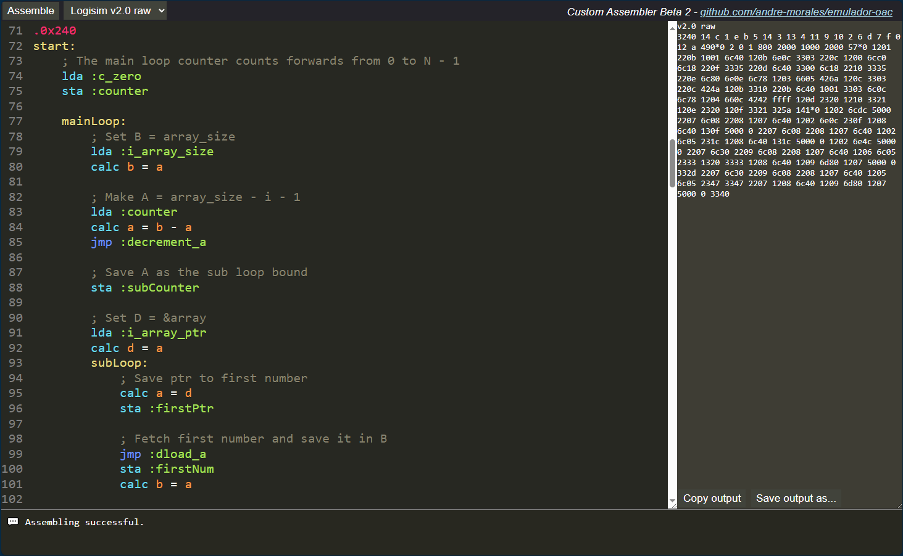

## :gear: EP3 - Assembler 

Resumo: Esse subprojeto implementa um assembler no navegador para a linguagem fictícia implementada pelo professor. O assembler functiona direto no navegador e é executado abrindo index.html.
As instruções são traduzidas para os binários no formato aceito raw v2.0 logisim.

Features:
- Declaração e uso de labels para instruções e dados. Permitindo organizar o código e variáveis
- Movimentação do ponteiro de escrita no arquivo
- Comentários
- Mnemônicos simplificados.