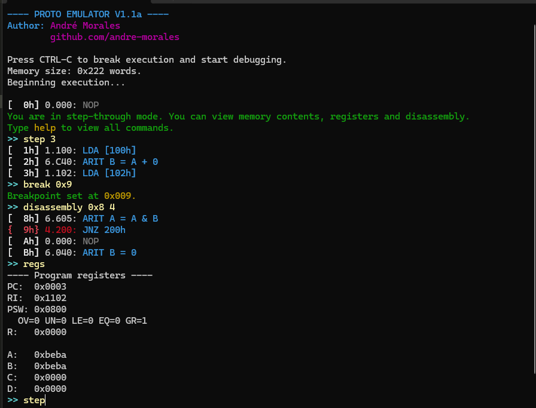

# Emulador e Depurador do Processador de OAC-I

Esse projeto implementa um emulador interativo completo do processador 16 bits visto na disciplina ministrada pelo professor Fábio Nakano.
O programa aceita como entrada os conteúdos da memória préviamente programada no simulador e executa sequencialmente as instruções, simulando o processador do Logisim.

## Uso
Este emulador permite controlar a execução do programa em qualquer ponto e visualizar o estado do processador e da memória através dos comandos de depuração.
Todos os comandos podem ser vistos com o emulador parado e digitando ```help``` no prompt.


## Exemplo



## Compilação
Para compilar o emulador, deve-se obter os arquivos **driverEP1.c** e **driverEP1.h** disponíveis no repositório ( https://github.com/fnakano/oac1 ) do professor.

O **Makefile** aqui disponibilizado já vem pronto para compilação, depuração e para alguns testes usando os arquivos de memória **.mem** também disponíveis no repositório mencionado.

No topo do arquivo principal há várias flags de compilação para que seja possível customizar o comportamento do emulador. A funcionalidade de cada flag é descrita no próprio código, mas também pode ser vista abaixo:

|Flag|Padrão|Função|
| - | - | - |
|DUMMY_MODE|false|Desativa todos os recursos interativos do emulador e o coloca num modo de apenas execução. O emulador só será interrompido no caso de uma instrução HLT ou apertar CTRL-C.|
|ENABLE_COLORS|true|Habilita o uso de cores na interface de linha de comando. Pode ser desativado no caso de terminais incompatíveis com os escapes ANSI.
|START_IN_BREAKING_MODE|true|Se o emulador deve parar logo antes de executar a primeira instrução da memória, dando a oportunidade de explorar o estado da memória antes de executar efetivamente as instruções.
|INSTALL_SIGINT_HANDLER|true|Habilita interceptar o CTRL-C do usuário para parar a execução do emulador sem sair do programa. Se configurado como falso, CTRL-C terá o comportamento padrão de sair inteiramente do programa.
|BREAK_AT_FAULTS|true|Quando verdadeiro, o emulador será interrompido sempre que encontrar uma falha na execução de uma instrução. Caso falso, executará as próximas instruções sem pausa.
|DEFAULT_EXTENDED_NOTATION|true|Se verdadeiro, utilizará uma notação mais visual para as instruções de operações aritméticas.
|FAULT_ON_LOOP_AROUND|true|Por padrão, o _wrap around_ do contador de programa gerará uma falha no emulador e interromperá a execução. Entretanto o _wrap around_ do _Program Counter_ pode ser um comportamento desejado. Neste caso, se configurado como falso, será gerado apenas um warning.
